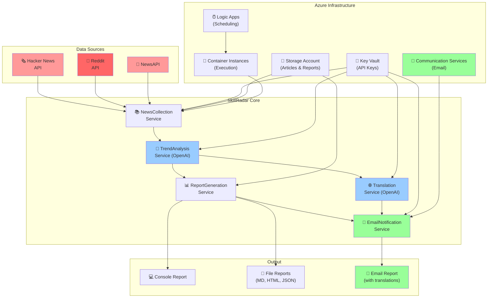

# 🔍 SkillRadar - Weekly Technology Trend Analysis System

[](https://github.com/yoshiwatanabe/skill-radar/actions/workflows/infrastructure.yml)
[](https://github.com/yoshiwatanabe/skill-radar/actions/workflows/app-deploy.yml)

**SkillRadar** is an automated weekly technology trend analysis system that collects articles from multiple sources, analyzes them using AI, and generates personalized learning recommendations. Every Sunday, it delivers a comprehensive report of the week's most important technology developments.

## 🎯 Features

- **Multi-Source Data Collection**: Aggregates content from Hacker News, Reddit, and NewsAPI
- **AI-Powered Analysis**: Uses OpenAI to identify trends and generate insights
- **Personalized Recommendations**: Tailors learning suggestions based on your profile
- **Multiple Output Formats**: Console, Markdown, HTML, and JSON reports
- **📧 Email Notifications**: Beautiful HTML email reports with Azure Communication Services
- **🌐 Multi-Language Support**: Optional Japanese translations for bilingual developers
- **Azure Cloud Infrastructure**: Scalable deployment with automated scheduling
- **GitHub Actions CI/CD**: Automated deployment and weekly execution

## 📊 Sample Output

```
=============================================================
 Weekly Tech Trend Report (Dec 1 - Dec 7, 2024)
=============================================================

🔥 TOP TRENDING TECHNOLOGIES
--------------------------------------------
1. **AI Agents & Autonomous Systems** (47 mentions)
   💡 Key insight: Production deployments increasing
   📚 Learning recommendation: Focus on LangChain/AutoGPT frameworks

2. **Azure OpenAI Service Updates** (23 mentions)  
   💡 Key insight: New GPT-4o integration features
   📚 Learning recommendation: Upgrade existing projects

📚 MUST-READ ARTICLES
--------------------------------------------
1. "Building Production AI Agents with Azure" - 95% relevance
   📰 Source: HackerNews
   🔗 URL: https://example.com/article1

🎯 THIS WEEK'S LEARNING FOCUS
--------------------------------------------
• Deep dive: AI Agent architecture patterns (estimated 4-6 hours)
• Quick win: Azure OpenAI new features (estimated 2 hours)
```

## 🚀 Quick Start

### Prerequisites

- Azure subscription
- OpenAI API key
- .NET 8.0 SDK (for local development)
- Azure CLI (for deployment)

### 1. Clone and Setup

```bash
git clone https://github.com/your-username/skill-radar.git
cd skill-radar
```

### 2. Configure Environment Variables

```bash
export OPENAI_API_KEY="your-openai-api-key"
export NEWS_API_KEY="your-newsapi-key"          # Optional
export REDDIT_CLIENT_ID="your-reddit-id"        # Optional
export REDDIT_CLIENT_SECRET="your-reddit-secret" # Optional

# Email Notifications (Optional)
export AZURE_COMMUNICATION_CONNECTION_STRING="endpoint=https://...;accesskey=..."
export EMAIL_SENDER_ADDRESS="DoNotReply@...azurecomm.net"
export EMAIL_RECIPIENT_ADDRESS="your-email@domain.com"
```

### 3. Deploy Infrastructure

```bash
cd infrastructure/scripts
chmod +x deploy.sh
./deploy.sh
```

### 4. Run Locally

```bash
cd src/SkillRadar.Console
dotnet restore
dotnet run
```

## 📁 Project Structure

```
skill-radar/
├── src/
│   └── SkillRadar.Console/          # Main console application
│       ├── Models/                  # Data models
│       ├── Services/                # Core services
│       ├── Program.cs               # Application entry point
│       └── appsettings.json         # Configuration
├── infrastructure/
│   ├── bicep/                       # Azure Bicep templates
│   │   ├── main.bicep              # Main infrastructure template
│   │   └── modules/                # Modular templates
│   └── scripts/
│       └── deploy.sh               # Deployment script
├── .github/
│   └── workflows/                  # GitHub Actions workflows
└── README.md
```

## 🏗️ Architecture



### Core Services

- **NewsCollectionService**: Collects articles from multiple APIs
- **TrendAnalysisService**: Analyzes trends using OpenAI GPT models
- **ReportGenerationService**: Generates reports in multiple formats
- **EmailNotificationService**: Sends beautiful HTML email reports via Azure Communication Services
- **TranslationService**: Provides multilingual support using OpenAI for translations

### Azure Infrastructure

- **Storage Account**: Article data persistence and report archiving
- **Key Vault**: Secure API key management
- **Communication Services**: Email delivery infrastructure
- **Container Instances**: Serverless execution environment
- **Logic Apps**: Weekly scheduling automation

### Data Flow

1. **Collection**: Gather articles from Hacker News, Reddit, NewsAPI
2. **Analysis**: AI-powered trend identification and summarization
3. **Translation**: Optional multilingual content generation
4. **Personalization**: Match trends to user profile and interests
5. **Generation**: Create comprehensive reports with visual dashboards
6. **Distribution**: Email delivery, console output, and file generation

## ⚙️ Configuration

### User Profile (`appsettings.json`)

```json
{
  "UserProfile": {
    "Skills": ["C#", "Azure", "Machine Learning"],
    "Interests": ["AI/ML", "Cloud Architecture"],
    "CareerStage": "Senior",
    "LearningGoals": ["System Design", "AI Implementation"]
  },
  "EmailSettings": {
    "Enabled": true,
    "SendOnSuccess": true,
    "SendOnError": true,
    "SecondaryLanguage": "JA"
  }
}
```

### Email Configuration

SkillRadar supports beautiful HTML email reports with optional multilingual content:

- **SecondaryLanguage Options**: `None`, `JA` (Japanese), `ES` (Spanish), `FR` (French), `DE` (German), etc.
- **Email Features**: Visual trending dashboard, article previews, consistent formatting
- **Azure Communication Services**: Enterprise-grade email delivery

### Data Sources

```json
{
  "DataSources": {
    "HackerNews": { "Enabled": true, "Priority": "High" },
    "Reddit": { 
      "Enabled": true,
      "Subreddits": ["programming", "MachineLearning", "dotnet"],
      "Priority": "Medium"
    },
    "NewsAPI": { "Enabled": true, "Priority": "Low" }
  }
}
```

## 🔧 API Keys Setup

### Required
- **OpenAI API Key**: Get from [OpenAI Platform](https://platform.openai.com/api-keys)
  - Used for trend analysis and optional translations
  - Supports GPT-3.5-turbo and GPT-4 models

### Optional (for enhanced features)
- **NewsAPI Key**: Get from [NewsAPI](https://newsapi.org/register)
- **Reddit API**: Create app at [Reddit Apps](https://www.reddit.com/prefs/apps)
- **Azure Communication Services**: Set up in [Azure Portal](https://portal.azure.com)
  - Required for email notifications
  - Provides sender domain and connection string

## 🚀 Deployment

### GitHub Actions Setup

1. Fork this repository
2. Set up Azure service principal:
   ```bash
   az ad sp create-for-rbac --name "SkillRadar" --role contributor --scopes /subscriptions/{subscription-id}
   ```
3. Add GitHub secrets:
   - `AZURE_CLIENT_ID`
   - `AZURE_TENANT_ID`
   - `AZURE_SUBSCRIPTION_ID`
   - `OPENAI_API_KEY`
   - `NEWS_API_KEY` (optional)
   - `REDDIT_CLIENT_ID` (optional)
   - `REDDIT_CLIENT_SECRET` (optional)
   - `AZURE_COMMUNICATION_CONNECTION_STRING` (optional)
   - `EMAIL_SENDER_ADDRESS` (optional)
   - `EMAIL_RECIPIENT_ADDRESS` (optional)

### Manual Deployment

```bash
# Deploy infrastructure
cd infrastructure/scripts
./deploy.sh

# Build and run application
cd ../../src/SkillRadar.Console
dotnet build
dotnet run
```

## 📈 Monitoring

### Azure Resources
- Monitor Container Instance execution in Azure Portal
- Check Key Vault for secret access
- Review Storage Account for data persistence

### GitHub Actions
- Infrastructure deployment status
- Weekly execution results
- Build and deployment logs

## 🔄 Scheduled Execution

The system runs automatically every Sunday at 9:00 AM JST via:
- GitHub Actions scheduled workflow
- Azure Logic Apps (backup scheduling)

Manual execution:
```bash
# Via GitHub Actions
gh workflow run app-deploy.yml

# Via Azure CLI
az container start --resource-group skillradar-rg --name skillradar-dev-aci
```

## 💰 Cost Estimation

**Monthly Azure costs:**
- Storage Account: ~$2
- Key Vault: ~$1
- Container Instances: ~$5-10
- Logic Apps: ~$1

**API costs:**
- OpenAI: ~$10-20 (depending on usage)
- NewsAPI: Free tier available
- Reddit API: Free

**Total: ~$20-35/month**

## 🔧 Local Development

### Prerequisites
```bash
# Install .NET 8.0
dotnet --version

# Set environment variables
export OPENAI_API_KEY="your-key"
```

### Run with Debug
```bash
cd src/SkillRadar.Console
dotnet run --debug
```

### Test Individual Services
```bash
# Test news collection only
dotnet run -- --collect-only

# Test analysis only  
dotnet run -- --analyze-only

# Generate report only
dotnet run -- --report-only
```

## 🤝 Contributing

1. Fork the repository
2. Create feature branch: `git checkout -b feature/amazing-feature`
3. Commit changes: `git commit -m 'Add amazing feature'`
4. Push to branch: `git push origin feature/amazing-feature`
5. Open Pull Request

### Development Guidelines
- Follow C# coding conventions
- Add unit tests for new features
- Update documentation
- Test with multiple API keys

## 🐛 Troubleshooting

### Common Issues

**OpenAI API Errors**
```bash
# Check API key
echo $OPENAI_API_KEY

# Test API connectivity
curl -H "Authorization: Bearer $OPENAI_API_KEY" https://api.openai.com/v1/models
```

**Azure Deployment Issues**
```bash
# Check Azure login
az account show

# Validate Bicep template
az bicep build --file infrastructure/bicep/main.bicep
```

**No Articles Collected**
- Verify internet connectivity
- Check API rate limits
- Ensure API keys are valid

### Debug Mode
```bash
dotnet run -- --debug
```

## 📝 License

This project is licensed under the MIT License - see the [LICENSE](LICENSE) file for details.

## 🙏 Acknowledgments

- [Hacker News API](https://github.com/HackerNews/API)
- [Reddit API](https://www.reddit.com/dev/api/)
- [NewsAPI](https://newsapi.org/)
- [OpenAI API](https://platform.openai.com/)

---

**Built with ❤️ for the developer community**

*SkillRadar helps you stay ahead of technology trends and focus your learning on what matters most.*

*Last updated: June 2025*