# 🔍 SkillRadar - Weekly Technology Trend Analysis System

[](https://github.com/yoshiwatanabe/skill-radar/actions/workflows/infrastructure.yml)
[](https://github.com/yoshiwatanabe/skill-radar/actions/workflows/app-deploy.yml)

**SkillRadar** is an automated weekly technology trend analysis system that collects articles from multiple sources, analyzes them using AI, and generates personalized learning recommendations. Every Thursday at 11 PM JST, it delivers a comprehensive report of the week's most important technology developments.

## 🏗️ Simple Architecture

**Current Design Philosophy:** Simplified GitHub Actions-based approach for reliable weekly automation.

- **Scheduling**: GitHub Actions cron jobs (every Thursday 11 PM JST)
- **Secrets Management**: GitHub Repository Secrets
- **Execution**: Dynamic Azure Container Instances
- **Storage**: Azure Storage Account for persistence
- **Notifications**: Azure Communication Services for email delivery

## 🎯 Features

- **Multi-Source Data Collection**: Aggregates content from Hacker News, Reddit, and NewsAPI
- **AI-Powered Analysis**: Uses OpenAI to identify trends and generate insights
- **Personalized Recommendations**: Tailors learning suggestions based on your profile
- **Multiple Output Formats**: Console, Markdown, HTML, and JSON reports
- **📧 Email Notifications**: Beautiful HTML email reports with Azure Communication Services
- **🌐 Multi-Language Support**: Optional Japanese translations for bilingual developers
- **Azure Cloud Infrastructure**: Scalable deployment with automated scheduling
- **GitHub Actions CI/CD**: Automated deployment and weekly execution

## 📊 Sample Output

```
=============================================================
 Weekly Tech Trend Report (Dec 1 - Dec 7, 2024)
=============================================================

🔥 TOP TRENDING TECHNOLOGIES
--------------------------------------------
1. **AI Agents & Autonomous Systems** (47 mentions)
   💡 Key insight: Production deployments increasing
   📚 Learning recommendation: Focus on LangChain/AutoGPT frameworks

2. **Azure OpenAI Service Updates** (23 mentions)  
   💡 Key insight: New GPT-4o integration features
   📚 Learning recommendation: Upgrade existing projects

📚 MUST-READ ARTICLES
--------------------------------------------
1. "Building Production AI Agents with Azure" - 95% relevance
   📰 Source: HackerNews
   🔗 URL: https://example.com/article1

🎯 THIS WEEK'S LEARNING FOCUS
--------------------------------------------
• Deep dive: AI Agent architecture patterns (estimated 4-6 hours)
• Quick win: Azure OpenAI new features (estimated 2 hours)
```

## 🚀 Quick Start

### Prerequisites

- Azure subscription
- OpenAI API key
- .NET 8.0 SDK (for local development)
- Azure CLI (for deployment)

### 1. Clone and Setup

```bash
git clone https://github.com/your-username/skill-radar.git
cd skill-radar
```

### 2. Configure Environment Variables

```bash
export OPENAI_API_KEY="your-openai-api-key"
export NEWS_API_KEY="your-newsapi-key"          # Optional
export REDDIT_CLIENT_ID="your-reddit-id"        # Optional
export REDDIT_CLIENT_SECRET="your-reddit-secret" # Optional

# Email Notifications (Optional)
export AZURE_COMMUNICATION_CONNECTION_STRING="endpoint=https://...;accesskey=..."
export EMAIL_SENDER_ADDRESS="DoNotReply@...azurecomm.net"
export EMAIL_RECIPIENT_ADDRESS="your-email@domain.com"
```

### 3. Deploy Infrastructure

```bash
cd infrastructure/scripts
chmod +x deploy.sh
./deploy.sh
```

### 4. Run Locally

```bash
cd src/SkillRadar.Console
dotnet restore
dotnet run
```

## 📁 Project Structure

```
skill-radar/
├── src/
│   └── SkillRadar.Console/          # Main console application
│       ├── Models/                  # Data models
│       ├── Services/                # Core services
│       ├── Program.cs               # Application entry point
│       └── appsettings.json         # Configuration
├── infrastructure/
│   ├── bicep/                       # Azure Bicep templates
│   │   ├── main.bicep              # Main infrastructure template
│   │   └── modules/                # Modular templates
│   └── scripts/
│       └── deploy.sh               # Deployment script
├── .github/
│   └── workflows/                  # GitHub Actions workflows
└── README.md
```

## 📋 Detailed Architecture

```mermaid
graph TB
    subgraph "Data Sources"
        HN["🗞️ Hacker News<br/>API"]
        RD["🔴 Reddit<br/>API"]
        NA["📰 NewsAPI"]
    end

    subgraph "GitHub Actions"
        GH["⏰ GitHub Actions<br/>(Scheduled Workflow)"]
        GS["🔐 GitHub Secrets<br/>(API Keys & Config)"]
    end

    subgraph "SkillRadar Core"
        NC["📚 NewsCollection<br/>Service"]
        TA["🤖 TrendAnalysis<br/>Service (OpenAI)"]
        RG["📊 ReportGeneration<br/>Service"]
        EN["📧 EmailNotification<br/>Service"]
        TS["🌐 Translation<br/>Service (OpenAI)"]
    end

    subgraph "Azure Infrastructure"
        SA["💾 Storage Account<br/>(Articles & Reports)"]
        ACS["📨 Communication Services<br/>(Email)"]
        CI["🐳 Container Instances<br/>(Execution)"]
    end

    subgraph "Output"
        CO["💻 Console Report"]
        FM["📄 File Reports<br/>(MD, HTML, JSON)"]
        EM["📧 Email Report<br/>(with translations)"]
    end

    HN --> NC
    RD --> NC
    NA --> NC
    
    NC --> TA
    TA --> RG
    RG --> EN
    TA --> TS
    TS --> EN
    
    GS --> NC
    GS --> TA
    GS --> EN
    GS --> TS
    
    SA --> NC
    SA --> RG
    ACS --> EN
    
    RG --> CO
    RG --> FM
    EN --> EM
    
    GH --> CI
    CI --> NC

    style HN fill:#ff9999
    style RD fill:#ff6666
    style NA fill:#ff9999
    style TA fill:#99ccff
    style TS fill:#99ccff
    style EN fill:#99ff99
    style ACS fill:#99ff99
    style EM fill:#99ff99
    style GH fill:#ffcc99
    style GS fill:#ffcc99
```



### Core Services

- **NewsCollectionService**: Collects articles from multiple APIs
- **TrendAnalysisService**: Analyzes trends using OpenAI GPT models
- **ReportGenerationService**: Generates reports in multiple formats
- **EmailNotificationService**: Sends beautiful HTML email reports via Azure Communication Services
- **TranslationService**: Provides multilingual support using OpenAI for translations

### Azure Infrastructure

- **Storage Account**: Article data persistence and report archiving
- **Communication Services**: Email delivery infrastructure
- **Container Instances**: Serverless execution environment

### GitHub Actions Infrastructure

- **Scheduled Workflows**: Weekly automation (every Thursday at 11:00 PM JST)
- **GitHub Secrets**: Secure API key and configuration management
- **Container Registry**: Docker image storage and versioning
- **Manual Triggers**: On-demand execution capabilities

### Data Flow

1. **Collection**: Gather articles from Hacker News, Reddit, NewsAPI
2. **Analysis**: AI-powered trend identification and summarization
3. **Translation**: Optional multilingual content generation
4. **Personalization**: Match trends to user profile and interests
5. **Generation**: Create comprehensive reports with visual dashboards
6. **Distribution**: Email delivery, console output, and file generation

## ⚙️ Configuration

### User Profile (`appsettings.json`)

```json
{
  "UserProfile": {
    "Skills": ["C#", "Azure", "Machine Learning"],
    "Interests": ["AI/ML", "Cloud Architecture"],
    "CareerStage": "Senior",
    "LearningGoals": ["System Design", "AI Implementation"]
  },
  "EmailSettings": {
    "Enabled": true,
    "SendOnSuccess": true,
    "SendOnError": true,
    "SecondaryLanguage": "JA"
  }
}
```

### Email Configuration

SkillRadar supports beautiful HTML email reports with optional multilingual content:

- **SecondaryLanguage Options**: `None`, `JA` (Japanese), `ES` (Spanish), `FR` (French), `DE` (German), etc.
- **Email Features**: Visual trending dashboard, article previews, consistent formatting
- **Azure Communication Services**: Enterprise-grade email delivery

### Data Sources

```json
{
  "DataSources": {
    "HackerNews": { "Enabled": true, "Priority": "High" },
    "Reddit": { 
      "Enabled": true,
      "Subreddits": ["programming", "MachineLearning", "dotnet"],
      "Priority": "Medium"
    },
    "NewsAPI": { "Enabled": true, "Priority": "Low" }
  }
}
```

## 🔧 API Keys Setup

### Required
- **OpenAI API Key**: Get from [OpenAI Platform](https://platform.openai.com/api-keys)
  - Used for trend analysis and optional translations
  - Supports GPT-3.5-turbo and GPT-4 models

### Optional (for enhanced features)
- **NewsAPI Key**: Get from [NewsAPI](https://newsapi.org/register)
- **Reddit API**: Create app at [Reddit Apps](https://www.reddit.com/prefs/apps)
- **Azure Communication Services**: Set up in [Azure Portal](https://portal.azure.com)
  - Required for email notifications
  - Provides sender domain and connection string

## 🚀 Deployment

### GitHub Actions Setup

1. Fork this repository
2. Set up Azure service principal:
   ```bash
   az ad sp create-for-rbac --name "SkillRadar" --role contributor --scopes /subscriptions/{subscription-id}
   ```
3. Add required GitHub secrets (Settings → Secrets and variables → Actions):

   **Required for Basic Functionality:**
   - `AZURE_CREDENTIALS` - Azure service principal credentials (JSON format)
   - `OPENAI_API_KEY` - OpenAI API key for trend analysis

   **Optional for Enhanced Features:**
   - `NEWS_API_KEY` - NewsAPI key for additional articles
   - `REDDIT_CLIENT_ID` - Reddit API client ID
   - `REDDIT_CLIENT_SECRET` - Reddit API client secret
   - `AZURE_STORAGE_CONNECTION_STRING` - Azure Storage for persistence
   - `AZURE_COMMUNICATION_CONNECTION_STRING` - Azure Communication Services for email
   - `EMAIL_SENDER_ADDRESS` - Sender email address (e.g., DoNotReply@yourdomain.azurecomm.net)
   - `EMAIL_RECIPIENT_ADDRESS` - Your email address for receiving reports

   **Optional Azure Resource Configuration:**
   - `AZURE_RESOURCE_GROUP` - Resource group name (defaults to 'skillradar-rg')
   - `AZURE_CONTAINER_GROUP_NAME` - Container group name (defaults to 'skillradar-dev-aci')

### Infrastructure Deployment

The infrastructure templates deploy only the essential Azure resources:

```bash
# Deploy minimal Azure infrastructure (Storage + Communication Services)
cd infrastructure/scripts
./deploy.sh
```

**What gets deployed:**
- Azure Storage Account (for data persistence)
- Azure Communication Services (for email notifications)
- Required RBAC permissions for GitHub Actions

**What does NOT get deployed:**
- Container Instances (created dynamically by GitHub Actions)
- Key Vault (simplified architecture uses GitHub Secrets)
- Logic Apps (removed in favor of GitHub Actions scheduling)

### Local Development

```bash
# Build and run application locally
cd src/SkillRadar.Console
dotnet restore
dotnet build
dotnet run
```

## 📈 Monitoring

### Azure Resources
- Monitor Container Instance execution in Azure Portal
- Review Storage Account for article and report data
- Check Communication Services for email delivery status

### GitHub Actions
- Weekly execution results and logs
- Infrastructure deployment status
- Build and deployment history
- Secret management and access (Settings → Secrets)

### Troubleshooting Workflow
1. Check GitHub Actions logs for execution details
2. Review Azure Container Instance logs in Azure Portal
3. Verify email delivery in Azure Communication Services
4. Check storage account for generated reports

## 🔄 Scheduled Execution

The system runs automatically every Thursday at 11:00 PM JST (14:00 UTC) via GitHub Actions scheduled workflow:

```yaml
schedule:
  # Run every Thursday at 11:00 PM JST (14:00 UTC) - ready for Friday learning
  - cron: '0 14 * * 4'
```

Manual execution:
```bash
# Via GitHub Actions (recommended)
gh workflow run app-deploy.yml

# Via GitHub web interface
# Go to Actions tab → Application Build & Deploy → Run workflow

# Check execution status
gh run list --workflow=app-deploy.yml
```

## 💰 Cost Estimation

**Monthly Azure costs:**
- Storage Account: ~$2-5 (depending on data retention)
- Container Instances: ~$5-10 (billed per execution)
- Communication Services: ~$1-3 (email volume dependent)

**API costs:**
- OpenAI: ~$10-20 (depending on usage and model choice)
- NewsAPI: Free tier available (1000 requests/day)
- Reddit API: Free

**GitHub Actions:**
- Free for public repositories
- GitHub Actions minutes included in most plans

**Total: ~$18-38/month** (primarily OpenAI usage)

## 🔧 Local Development

### Prerequisites
```bash
# Install .NET 8.0
dotnet --version

# Create .env file in project root (optional, for local testing)
cat > .env << EOF
OPENAI_API_KEY=your-openai-api-key
NEWS_API_KEY=your-newsapi-key
REDDIT_CLIENT_ID=your-reddit-client-id
REDDIT_CLIENT_SECRET=your-reddit-client-secret
AZURE_STORAGE_CONNECTION_STRING=DefaultEndpointsProtocol=https;AccountName=...
AZURE_COMMUNICATION_CONNECTION_STRING=endpoint=https://...;accesskey=...
EMAIL_SENDER_ADDRESS=DoNotReply@yourdomain.azurecomm.net
EMAIL_RECIPIENT_ADDRESS=your-email@domain.com
EOF
```

### Run with Debug
```bash
cd src/SkillRadar.Console
dotnet run --debug
```

### Test Data Sources
```bash
# Test individual data sources and see sample output
dotnet run -- --debug-sources
```

## 🤝 Contributing

1. Fork the repository
2. Create feature branch: `git checkout -b feature/amazing-feature`
3. Commit changes: `git commit -m 'Add amazing feature'`
4. Push to branch: `git push origin feature/amazing-feature`
5. Open Pull Request

### Development Guidelines
- Follow C# coding conventions
- Add unit tests for new features
- Update documentation
- Test with multiple API keys

## 🐛 Troubleshooting

### Common Issues

**OpenAI API Errors**
```bash
# Check API key
echo $OPENAI_API_KEY

# Test API connectivity
curl -H "Authorization: Bearer $OPENAI_API_KEY" https://api.openai.com/v1/models
```

**Azure Deployment Issues**
```bash
# Check Azure login
az account show

# Validate Bicep template
az bicep build --file infrastructure/bicep/main.bicep
```

**No Articles Collected**
- Verify internet connectivity
- Check API rate limits
- Ensure API keys are valid

### Debug Mode
```bash
dotnet run -- --debug
```

## 📝 License

This project is licensed under the MIT License - see the [LICENSE](LICENSE) file for details.

## 🙏 Acknowledgments

- [Hacker News API](https://github.com/HackerNews/API)
- [Reddit API](https://www.reddit.com/dev/api/)
- [NewsAPI](https://newsapi.org/)
- [OpenAI API](https://platform.openai.com/)

---

**Built with ❤️ for the developer community**

*SkillRadar helps you stay ahead of technology trends and focus your learning on what matters most.*

*Last updated: June 2025*